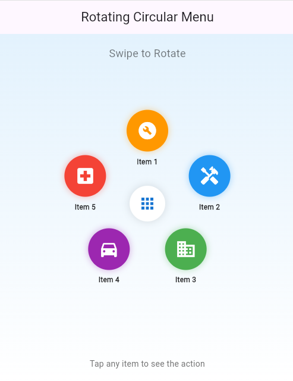
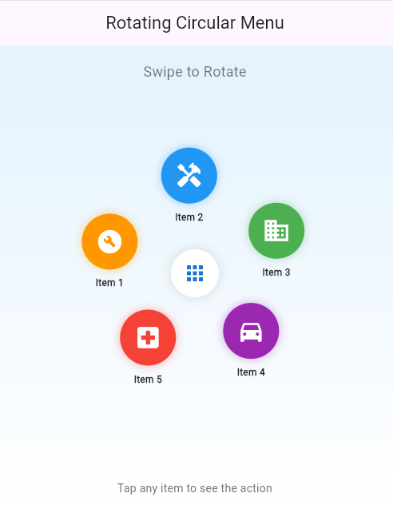
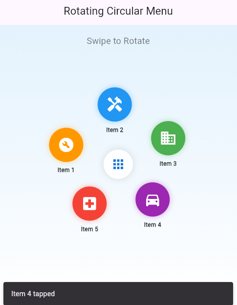
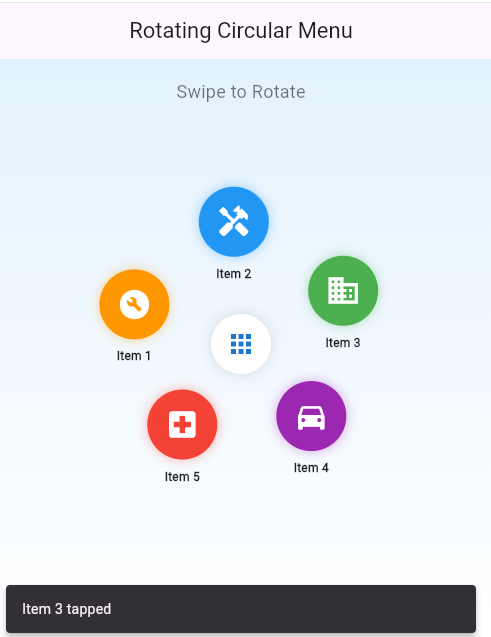

Flutter Rotating Circular Menu
A beautiful and interactive rotating circular menu widget for Flutter with physics-based animations and smooth gesture controls.

Show Image

Features
Physics-based rotation - Natural momentum and friction simulation
Smooth animations - Elastic entrance animations for menu items
Gesture controls - Intuitive pan gestures to rotate the menu
Highly customizable - Adjust radius, item count, colors, and more
Responsive - Works on any screen size
Performance optimized - Uses Ticker for smooth 60fps animations

Screenshots

     

Installation
Add this to your package's pubspec.yaml file:

yaml
dependencies:
  flutter:
    sdk: flutter
  flutter_hooks: ^0.20.0
  hooks_riverpod: ^2.4.0
Then run:

bash
flutter pub get
Usage
Basic Example
dart
import 'package:flutter/material.dart';
import 'rotating_menu_widget.dart';

void main() {
  runApp(MyApp());
}

class MyApp extends StatelessWidget {
  @override
  Widget build(BuildContext context) {
    return MaterialApp(
      home: Scaffold(
        appBar: AppBar(title: Text('Rotating Menu Demo')),
        body: Center(
          child: RotatingMenuWidget(
            items: [
              MenuItem(
                title: 'Option 1',
                icon: Icons.home,
                onTap: () => print('Option 1 tapped'),
              ),
              MenuItem(
                title: 'Option 2',
                icon: Icons.settings,
                onTap: () => print('Option 2 tapped'),
              ),
              // Add more items...
            ],
          ),
        ),
      ),
    );
  }
}
Advanced Customization
dart
RotatingMenuWidget(
  items: menuItems,
  radius: 120.0,              // Distance from center
  itemSize: 70.0,             // Size of each menu item
  centerWidget: Icon(
    Icons.apps,
    size: 50,
    color: Colors.blue,
  ),
  friction: 0.05,             // Lower = spins longer
  animationDuration: Duration(milliseconds: 300),
)
How It Works
The widget uses several Flutter features to create the smooth rotating experience:

Physics Simulation - FrictionSimulation provides natural deceleration after flinging
Ticker - Ensures smooth 60fps animation updates
Gesture Detection - Pan gestures track finger movement and calculate velocity
Trigonometry - Items are positioned in a circle using sin and cos
Hooks - flutter_hooks simplifies state management and lifecycle
Customization Options
Property	Type	Default	Description
items	List<MenuItem>	required	List of menu items to display
radius	double	110.0	Distance from center to items
itemSize	double	70.0	Size of each menu item
centerWidget	Widget?	null	Widget to display in the center
friction	double	0.05	Friction coefficient (lower = spins longer)
animationDuration	Duration	200ms	Duration for item entrance animations
MenuItem Properties
dart
MenuItem(
  title: 'Title',           // Text displayed below icon
  icon: Icons.home,         // Icon or custom widget
  onTap: () {},            // Callback when tapped
  backgroundColor: Colors.blue, // Optional background color
  iconColor: Colors.white,  // Optional icon color
)
Dependencies
flutter_hooks - For cleaner state management
hooks_riverpod - State management (optional, can be removed)
Removing Dependencies
If you want to use this without hooks_riverpod, you can convert the HookConsumerWidget to a regular StatefulWidget.

Performance Tips
Keep item count reasonable (5-8 items work best)
Use cached images or icons instead of loading from network
Avoid heavy computations in onTap callbacks
Contributing
Contributions are welcome! Please feel free to submit a Pull Request.

License
This project is licensed under the MIT License - see the LICENSE file for details.

Credits
Created with ❤️ by Kindertec

Support
If you find this package useful, please give it a ⭐️ on GitHub!

Changelog
Version 1.0.0
Initial release
Physics-based rotation
Gesture controls
Customizable appearance
